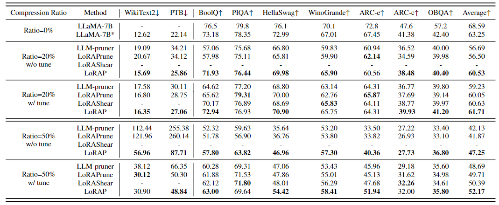

<div align="center">

<h3>[ICML 2024] LoRAP: Transformer Sub-Layers Deserve Differentiated Structured Compression for Large Language Models<h3>
</div>

<p align="center">
    
</p>


## Introduction
  
> **[LoRAP: Transformer Sub-Layers Deserve Differentiated Structured Compression for Large Language Models]** [[ArXiv]](https://arxiv.org/abs/2404.09695)   
> *Guangyan Li,Yongqiang Tang, Wensheng Zhang*   
> *Institute of Automation, Chinese Academy of Sciences*  

#### Supported LLMs:
- [x] [LLaMA-1]()
- [x] [Vicuna](https://github.com/lm-sys/FastChat)
- [x] [LLaMA-2](https://huggingface.co/meta-llama/Llama-2-7b-hf)

## Table of Contents
  - [Installation](#Installation)
  - [Compression Instruction](#Compression-instruction)
  - [Model Evaluation](#model-evaluation)
  - [Acknowledgement](#acknowledgement)
  - [Citation](#citation)


## Installation

Instructions of Model compression environment can be found in [INSTALL.md](INSTALL.md).

The evaluation environment is consistent with <a href="https://github.com/horseee/LLM-Pruner">LLM-Pruner</a> and can be referred to requirement.txt

### Minimal Example
```
bash llama_7b.sh
```
This script would compress the LLaMA-7B model with 20% parameters by LoRAP.

    
## Compression Instruction


**LLaMA-7B compressed with ~20% parameters:**
```
python main.py \
    --model decapoda-research/llama-7b-hf \
    --dataset bookcorpus \
    --sparsity_ratio 0.2 \
    --para_allocate 3 \
    --mlp_compress_method prune \
    --deco_method AWSVD \
    --sublayer self_attn,mlp \
    --save_model "compressed_model/lorap_0.2/" \
    --real_com False \
```
Arguments:
- `--model`: The identifier for the LLaMA model on the Hugging Face model hub. The model name is used for `AutoModelForCausalLM.from_pretrained` to load the pre-trained LLM. For example, if you want to use the LLaMA with 7 billion parameters, than pass `decapoda-research/llama-7b-hf` to `--model`.
- `--dataset`: The dataset of calibraton data, you can choose from [`c4`, `PTB`, `wikitest2`,`bookcorpus`]. The default is `bookcorpus`.
- `--sparsity_ratio`: Proportion of reduced model parameters.
- `--para_allocate`: The parameter ratio of (W<sub>v</sub> + W<sub>o</sub>) : (W<sub>q</sub> + W<sub>k</sub>).
- `--mlp_compress_method`: Compression methods for mlp sublayers, namely [`prune`, `decom`]. The default is `prune`.
- `--deco_method`: The method used for matrix factorization, namely [`AWSVD`, `AFM`, `SVD`]. The default is `AWSVD`.
- `--sublayer`: Sublayers that require compression, the default is [`self_attn`, `mlp`], you also can `self_attn` or `mlp`.
- `--save_model`: Specifies the directory where the compressed model will be stored.
- `--real_com`: Whether to actually compress the model.

After compression, we refer to <a href="https://github.com/horseee/LLM-Pruner">LLM-Pruner</a> for Lora fine-tuning as well as evaluation. The latest version of the evaluation is <a href="https://github.com/EleutherAI/lm-evaluation-harness">lm-evaluation-harness</a>.
Since LoRA fine-tuning only supports torch.nn.Linear and Conv1D, the model isn't compressed during compression. Instead, after fine-tuning, the model is decomposed once again based on `After_tune.py`.

## Model Evaluation

The performance of compressed model on language modeling and zero-shot :


<p align="center">
 <br>
</p>
 
More results can be found in the paper. 


## Acknowledgement
* The README.md: our README.md references <a href="https://github.com/horseee/LLM-Pruner">LLM-Pruner</a> and <a href="https://github.com/CASIA-IVA-Lab/FLAP/tree/main">FLAP</a>, thanks to them for providing readable and beautifully formatted README documents.
* The evaluation of the LLM:  <a href="https://github.com/EleutherAI/lm-evaluation-harness">lm-evaluation-harness</a>.
* LLaMA: <a href="https://github.com/facebookresearch/llama"> https://github.com/facebookresearch/llama </a>.
* Vicuna: <a href="https://github.com/lm-sys/FastChat">https://github.com/lm-sys/FastChat </a>.

## Citation
If you find this project useful, please cite
```
@misc{li2024lorap,
      title={LoRAP: Transformer Sub-Layers Deserve Differentiated Structured Compression for Large Language Models}, 
      author={Guangyan Li and Yongqiang Tang and Wensheng Zhang},
      year={2024},
      eprint={2404.09695},
      archivePrefix={arXiv},
      primaryClass={cs.LG}
}
```